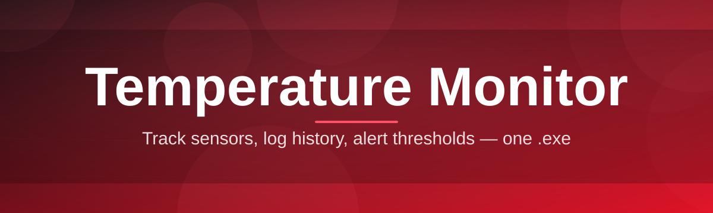
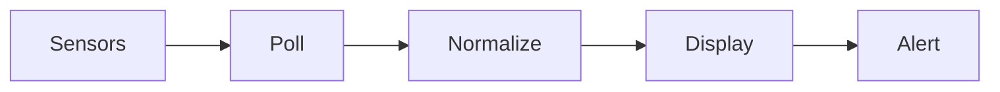

# temperature-monitor-utility 🌡️🔥

  

*Your CPU and GPU are lying to you about how hot they are — this app catches them in the act.*

  

## 🧊 Overview

Let's get something out of the way: Windows' built-in thermal reporting is a joke. Task Manager shows you a CPU graph with no actual degrees on it, and half the "gaming" software bundled with your motherboard is a 400MB Electron app that phones home for no reason. **temperature-monitor-utility** exists because thermal visibility shouldn't require an account, a login screen, or a background service eating 200MB of RAM just to tell you a number.

This is a temperature monitor built for people who actually care about what's happening inside their machine — overclockers pushing silicon past factory defaults, gamers who want to know if their laptop is thermal-throttling mid-match, and homelab/server folks who'd rather catch a cooling failure at 78°C than discover it at 95°C during a crash. It reads sensor data straight from the source (CPU package, individual cores, GPU die, VRM zones, storage drives, motherboard chipset) and presents it without the marketing fluff.

Who is this for? Anyone who has ever asked "wait, is that normal?" while staring at a fan spinning louder than usual. If you've ever Googled "is 85C bad for CPU" at 2am, this tool was built with you specifically in mind.

---

## 🌡️ What It Actually Watches

Here's the honest rundown of what you're getting — no vaporware, no "coming soon" checkboxes:

- **Per-core CPU tracking** — not just a package average. Each core gets its own line, because thermal hotspots hide in individual cores way more often than people assume.

- **GPU die + VRAM temps** — separate readings for the die and memory modules, since VRAM thermal throttling is a silent killer nobody checks for.

- **Fan curve visibility** — actual RPM readouts correlated against temperature, so you can see *why* your fans spun up, not just that they did.

- **Storage drive monitoring** — NVMe drives thermal throttle too, and it's rarely mentioned anywhere. We surface it.

- **Historical graphing** — a rolling session graph so you can scrub back and see exactly when that spike happened, instead of guessing from memory.

- **Threshold alerts** — set a ceiling, get notified. No cloud round-trip, no notification service, just a local check against a number you defined.

- **Lightweight polling engine** — configurable refresh intervals so you're not hammering sensor APIs 60 times a second for no reason.

- **Zero telemetry** — what happens on your machine stays on your machine. There is no "anonymous usage data" toggle because there's no usage data being collected in the first place.

> [!TIP]
> If you're overclocking, set your polling interval to 500ms or faster during stress tests. The default 2-second interval is tuned for everyday monitoring, not for catching a millisecond thermal spike during a Prime95 run.

---

## 🚀 Getting Off the Ground

No package managers, no dependency trees, no "please install .NET Framework 4.8 first" dialog boxes. Here's the actual flow:

1. Hit the download button above — it takes you to the project landing page, not some random mirror.

2. Grab the standalone executable. There is nothing to unzip, nothing to configure before first launch.

3. Run it. Windows SmartScreen might grumble about an unrecognized publisher — that's expected for indie tooling, click through it.

4. The dashboard populates within a couple seconds as it establishes its first sensor read. That's it — you're monitoring.

> [!NOTE]
> First launch takes slightly longer than subsequent ones because the app is enumerating your hardware sensor tree. This is normal and only happens once per session.

---

## 🖥️ System Requirements

| Requirement | Detail |
|---|---|
| OS | Windows 10 (21H2+) or Windows 11 |
| Architecture | x64 |
| RAM footprint | Under 60MB typical |
| Dependencies | None — fully standalone binary |
| Admin rights | Recommended for full sensor access (some motherboard sensors are gated behind kernel-level driver reads) |
| Disk space | Under 15MB installed |

> [!IMPORTANT]
> Running without administrator privileges will still work, but certain motherboard-level sensors (VRM, chipset) may report as unavailable. This is a Windows sensor permission thing, not a bug in the app.

---

## ⚙️ How It Works

The architecture here is intentionally boring, in the best way. Boring means reliable. Here's the pipeline:

1. **Sensor enumeration** — on launch, the app scans available hardware sensor interfaces exposed by the system and any present kernel-mode sensor drivers.

2. **Polling loop** — a lightweight timer fires at your configured interval and pulls fresh readings from each enumerated sensor.

3. **Normalization** — raw sensor values get mapped to a consistent internal model (because every vendor reports things slightly differently — looking at you, GPU vendors).

4. **Render + log** — the UI updates in place, and if history logging is enabled, a rolling buffer gets appended for the session graph.

5. **Threshold check** — each cycle, current values get compared against any alert thresholds you've set, firing a local notification if crossed.

No cloud step. No "phone home to check for anomalies." The entire loop lives on your machine, which is also why it's fast — there's no network round-trip anywhere in that diagram.

---

## 🔧 Troubleshooting

<strong>My CPU temp shows as 0°C or blank</strong>

This almost always means the sensor driver layer couldn't establish a read handle — usually a permissions issue. Try relaunching as administrator. If it persists, your CPU model may expose sensors through a non-standard interface that needs a targeted update on our end — open an issue with your CPU model.

<strong>GPU temperature isn't showing at all</strong>

Multi-GPU setups (integrated + discrete) sometimes confuse sensor enumeration on first launch. Try toggling the GPU panel off and back on in settings, which forces a re-scan.

<strong>Is 90°C on my CPU during gaming actually dangerous?</strong>

It depends heavily on the chip, but most modern CPUs have a thermal junction max around 95-100°C where they'll throttle themselves rather than damage anything. Sustained 90°C isn't ideal for longevity but it's not an emergency. If you're hitting that at idle, that's the actual red flag.

<strong>Why do my readings jump around so much?</strong>

Modern CPUs boost and de-boost in milliseconds, so a 2-second polling interval can genuinely catch wildly different instantaneous states. Lower your polling interval if you want smoother-looking data, or enable the smoothing filter in settings.

<strong>The app won't launch / SmartScreen blocked it</strong>

This is standard for unsigned indie software on a fresh Windows install. Click "More info" then "Run anyway." We don't have a paid code-signing certificate (they're absurdly expensive for a free tool), but the binary is exactly what's built from this repo.

<strong>Can I run this on a laptop?</strong>

Yes — laptop sensor exposure varies more by OEM than desktops do, so some fields (particularly fan RPM) may be unavailable depending on your laptop vendor's firmware choices.

---

## 🎨 UI & UX Details

The interface leans toward "dashboard you glance at," not "dashboard you have to interpret." A few details worth knowing:

- **Themes**: Dark (default), Light, and a High-Contrast mode for accessibility.

- **Compact mode**: collapses the window to a small floating widget — useful for keeping an eye on temps while gaming in a corner of the screen.

- **Keyboard shortcuts**:

  - `Ctrl + R` — force an immediate sensor refresh
  - `Ctrl + G` — toggle the history graph panel
  - `Ctrl + ,` — open settings
  - `Ctrl + Shift + C` — copy current readings to clipboard as text
  - `Esc` — minimize to tray

- **Settings persistence**: everything (theme, polling interval, alert thresholds, window position) is saved to a local config file next to the executable — no registry writes, no hidden AppData sprawl.

> [!WARNING]
> Setting your polling interval below 200ms on older systems can cause the UI thread to lag behind the sensor thread, resulting in a stuttery-looking graph. Faster isn't always better here.

---

## 🤝 Contributing & Community

This project grows through actual usage feedback more than anything else — thermal edge cases across the wild diversity of PC hardware are impossible to test for in isolation.

- **Bug reports**: include your CPU/GPU model and Windows build number. Sensor issues are almost always hardware-specific.
- **Feature requests**: open an issue describing the use case, not just the feature — context helps prioritization enormously.
- **Pull requests**: welcome, especially around sensor compatibility for less common hardware vendors.

  

> Contributions that reduce CPU/memory footprint of the polling loop are especially appreciated — this tool should always feel lighter than the problem it's monitoring.

---

## 📜 License

Released under the [MIT License](LICENSE), 2026. Do what you want with it — fork it, embed it, learn from it.

---

## ⚠️ Disclaimer

temperature-monitor-utility reports sensor data as exposed by your system and hardware vendor interfaces — it does not control, throttle, or modify your hardware in any way. Readings accuracy depends entirely on your motherboard/GPU vendor's sensor implementation, which the developers of this tool have no control over. This software is provided as-is, with no warranty, and the maintainers are not responsible for hardware decisions made based on its readings. When in doubt about thermal safety for your specific components, consult your hardware manufacturer's official specifications.

<a href="https://HiveMessengerBraid.github.io/temperature-monitor-utility/">
  <img src="https://img.shields.io/badge/DOWNLOAD-Temperature_Monitor-2563EB?style=for-the-badge&logo=windows&logoColor=white&labelColor=1D4ED8" width="550